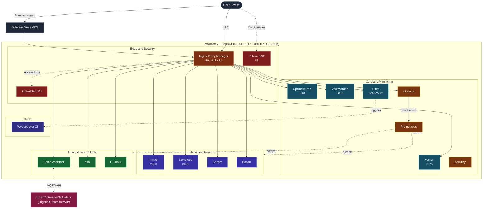

# Homelab

Declarative, Ansible-driven infrastructure for a Proxmox-based homelab — self-hosted media, productivity, security, monitoring, home automation, and CI/CD services running across isolated LXC containers, with a growing ESP32 sensor/automation footprint and an early Kubernetes track.


---

## Table of Contents

* [Overview](https://www.google.com/search?q=%23overview)
* [Tech Stack](https://www.google.com/search?q=%23tech-stack)
* [Architecture](https://www.google.com/search?q=%23architecture)
* [Hardware](https://www.google.com/search?q=%23hardware)
* [Services](https://www.google.com/search?q=%23services)
* [ESP32 / Embedded](https://www.google.com/search?q=%23esp32--embedded)
* [Kubernetes Track](https://www.google.com/search?q=%23kubernetes-track)
* [Repository Structure](https://www.google.com/search?q=%23repository-structure)
* [Getting Started](https://www.google.com/search?q=%23getting-started)
* [Configuration and Secrets](https://www.google.com/search?q=%23configuration-and-secrets)
* [Security Considerations](https://www.google.com/search?q=%23security-considerations)
* [Notes and Considerations](https://www.google.com/search?q=%23notes-and-considerations)
* [Roadmap](https://www.google.com/search?q=%23roadmap)
* [Contributing](https://www.google.com/search?q=%23contributing)
* [License](https://www.google.com/search?q=%23license)
* [Acknowledgments](https://www.google.com/search?q=%23acknowledgments)

---

## Overview

This repository is the single source of truth for a self-hosted homelab running on a single Proxmox VE node. Ansible drives repeatable, idempotent deployment of Dockerized services into individual LXC containers, so the core stack can be rebuilt from a clean host with one playbook run. The rest of the catalog deploys with a single `docker compose up -d` per service. DNS, reverse proxying, backups, file sync, monitoring, CI, home automation, and household tooling all live in version control here instead of being clicked together by hand.

This repository is intentionally **scoped to services** — network topology, VLANs, firewall rules, and reverse-proxy routing at the network level.

Beyond the Docker/Ansible service layer, the repo now also tracks:

* `esp32/` — embedded firmware and configs for ESP32-based home automation (irrigation control, plus a "footprint" effort still in early planning).
* `kubernetes/` — an early-stage Kubernetes track, consistent with `ROADMAP.md`'s stated evaluation of K3s vs. Docker Swarm for high availability. This is **not** a production orchestration layer yet — see [Kubernetes Track](https://www.google.com/search?q=%23kubernetes-track).

---

## Tech Stack

| Layer | Technology |
| --- | --- |
| **Hypervisor** | Proxmox VE 9.2.4 — LXC containers + QEMU VMs |
| **Configuration management** | Ansible (playbook-driven, idempotent) |
| **Containers** | Docker Engine + Docker Compose v2 |
| **Reverse proxy / TLS** | Nginx Proxy Manager (Let's Encrypt) |
| **DNS / ad-blocking** | Pi-hole |
| **Intrusion prevention** | CrowdSec |
| **Metrics** | Prometheus |
| **Dashboards** | Grafana |
| **Home automation** | Home Assistant + ESP32 firmware |
| **CI/CD** | Woodpecker CI |
| **Workflow automation** | n8n |
| **Disk health monitoring** | Scrutiny |
| **Remote access** | Tailscale mesh VPN (no inbound ports exposed to the internet) |
| **Orchestration (evaluating)** | Kubernetes (early track — see [Kubernetes Track](https://www.google.com/search?q=%23kubernetes-track)) |
| **Networking** | Dedicated bridge network `vmbr1` + per-service static LAN IPs |

---

## Architecture

Each service runs in its own LXC container with a dedicated static IP on the LAN rather than sharing a single Docker host. Nginx Proxy Manager terminates TLS and routes hostnames to each container, Pi-hole resolves DNS for the LAN, CrowdSec watches the proxy's access logs for abuse, and Prometheus + Grafana provide metrics and dashboards across the stack.



> **Legend:** Solid arrows follow user/traffic flow; dotted arrows represent DNS queries, log ingestion, metrics scraping, and device telemetry.

---

## Hardware

| Component | Detail |
| --- | --- |
| **CPU** | Intel Core i3-10100F — 4 cores / 8 threads @ 4.30 GHz |
| **GPU** | NVIDIA GeForce GTX 1050 Ti (4 GB VRAM) |
| **RAM** | 8 GB DDR4 |
| **Storage** | 512 GB SATA SSD |
| **Hypervisor OS** | Proxmox VE 9.2.4 |
| **Kernel** | Linux 7.0.14-3-pve |
| **Virtualization** | LXC containers + QEMU VMs |
| **Embedded nodes** | ESP32 (irrigation control; additional "footprint" nodes WIP) |
| **Remote networking** | Tailscale mesh VPN |

---

## Services

The `services/` directory currently contains 17 subdirectories. Descriptions below are marked **(verified)** where I fetched and read the actual compose file, and **(inferred from filename)** where I'm relying on the tool/service being well-known.

### Edge and Security

| Service | Description | Deploy | Status |
| --- | --- | --- | --- |
| **Nginx Proxy Manager** | Reverse proxy fronting every web UI; issues and renews Let's Encrypt certificates | Manual | (verified, prior README) |
| **Pi-hole** | Network-wide DNS sinkhole that blocks ads and trackers at the DNS layer | Manual | (verified, prior README) |
| **CrowdSec** | Parses Nginx access logs and blocks IPs matching known attack signatures | Ansible | (verified, prior README) |

### Core and Monitoring

| Service | Description | Deploy | Status |
| --- | --- | --- | --- |
| **Homarr** | Single-pane dashboard linking every service, with live CPU/RAM/disk widgets | Ansible | (verified, prior README) |
| **Uptime Kuma** | Polls every service on an interval and alerts when one goes down | Ansible | (verified, prior README) |
| **Vaultwarden** | Bitwarden-compatible vault for storing and syncing credentials | Ansible | (verified, prior README) |
| **Gitea** | Self-hosted Git remote for private repositories | Manual | (verified, prior README) |
| **Prometheus** | Metrics collection and scraping across the stack | Manual | **New** — compose + config committed minutes ago (inferred from filename: `docker-compose.yml` + a Prometheus config file) |
| **Grafana** | Dashboards and visualization on top of Prometheus metrics | Manual | **New** — compose committed minutes ago (inferred from filename) |
| **Scrutiny** | S.M.A.R.T. disk health monitoring and alerting | Manual | **New** — compose committed minutes ago (inferred from filename) |

### Media and Files

| Service | Description | Deploy | Status |
| --- | --- | --- | --- |
| **Immich** | Backs up phone photos/videos with facial recognition and albums | Ansible | (verified, prior README) |
| **Nextcloud** | File sync, share links, and office collaboration | Manual | (verified, prior README) |
| **Sonarr** | Monitors and automatically fetches TV episodes (part of `arr-suite/`) | Manual | (verified, prior README) |
| **Bazarr** | Fetches matching subtitles for the Sonarr library (part of `arr-suite/`) | Manual | (verified, prior README) |

### Automation and Tools

| Service | Description | Deploy | Status |
| --- | --- | --- | --- |
| **Home Assistant** | Home automation hub; likely the control plane for the ESP32 irrigation node given the repo's embedded footprint | Manual | **New** — files added via upload, not yet reviewed |
| **n8n** | Workflow/automation orchestration (webhooks, integrations, scheduled jobs) | Manual | **New** — compose committed minutes ago (inferred from filename) |
| **IT-Tools** | Self-hosted collection of everyday developer/IT utilities | Manual | **New** — compose committed minutes ago (inferred from filename) |

### CI/CD

| Service | Description | Deploy | Status |
| --- | --- | --- | --- |
| **Woodpecker CI** | Lightweight CI/CD pipeline runner, plausibly wired to Gitea for build triggers | Manual | **New** — compose committed minutes ago (inferred from filename) |

### Networking *(Scope Discrepancy)*

| Service | Description | Deploy | Status |
| --- | --- | --- | --- |
| **OPNsense** | A router/firewall with the Suricata IPS/IDS protection. | Manual |

---

## Embedded

The `esp32/` directory tracks firmware and device configs for home-automation hardware, separate from the Docker/Ansible service layer.

```text
esp32/
├── irrigation/
│   └── files/
│       ├── config.yaml       # base device configuration
│       ├── main.cpp          # firmware entry point
│       ├── sector_1.yaml     # per-zone/sector configuration
│       ├── timpi.yaml        # timing/schedule configuration
│       └── valve.cpp         # valve control logic
└── footprint/
    └── WIP.md                 # planning doc — not yet implemented

```

* `irrigation/` — an ESP32-driven irrigation controller: `main.cpp` and `valve.cpp` suggest firmware handling valve actuation, with `config.yaml`, `sector_1.yaml`, and `timpi.yaml` as YAML-based zone/schedule configuration.
* `footprint/` — currently just a `WIP.md` planning document; no implementation yet. Treat as a placeholder for a future ESP32 effort.

---

## Kubernetes Track

Per `ROADMAP.md`, Kubernetes (K3s specifically) is being evaluated as a path toward multi-node HA — it is explicitly **not** yet the primary orchestration layer; the primary stack remains Docker Compose + Ansible on a single node.

```text
kubernetes/
├── ansible/          # Ansible tooling scoped to k8s bootstrap/management
└── deploy.mk         # Makefile-driven deployment entrypoint

```

---

## Repository Structure

```text
homelab/
├── README.md
├── ROADMAP.md
├── CONTRIBUTING.md
├── LICENSE
├── hardware/
│   └── hardware.md
├── ansible/
│   └── group_vars/
│       ├── all.yml
│       ├── deploy_services.yml
│       └── inventory.ini
├── inventory/
│   └── hosts.yml                      # Ansible inventory (per CONTRIBUTING.md §5.1 convention)
├── esp32/
│   ├── irrigation/
│   │   └── files/
│   │       ├── config.yaml
│   │       ├── main.cpp
│   │       ├── sector_1.yaml
│   │       ├── timpi.yaml
│   │       └── valve.cpp
│   └── footprint/
│       └── WIP.md
├── kubernetes/
│   ├── ansible/
│   └── deploy.mk
└── services/
    ├── arr-suite/
    │   ├── docker-compose-bazarr.yml
    │   └── docker-compose-sonarr.yml
    ├── crowdsec/docker-compose.yml
    ├── gitea/docker-compose.yml
    ├── grafana/docker-compose.yml
    ├── homarr/docker-compose.yml
    ├── homeassistant/                 # contents added via upload
    ├── immich/docker-compose.yml
    ├── it-tools/docker-compose.yml
    ├── n8n/docker-compose.yml
    ├── nextcloud/docker-compose.yml
    ├── nginx/docker-compose.yml       # Nginx Proxy Manager
    ├── opnsense/                      # scope discrepancy — see Notes
    ├── pi-hole/docker-compose.yml
    ├── prometheus/                    # docker-compose.yml + config file
    ├── scrutiny/docker-compose.yml
    ├── uptime-kuma/docker-compose.yml
    ├── vaultwarden/docker-compose.yml
    └── woodpecker-ci/docker-compose.yml

```

---

## Getting Started

### Prerequisites

* Proxmox VE host with LXC containers provisioned for each service
* Docker Engine + Docker Compose v2 on every target container
* Python 3 on target nodes (required by Ansible)
* Ansible on the control node, with SSH key access to every container
* Tailscale on the control node for remote management
* *(If working with `esp32/`)* PlatformIO or Arduino IDE with ESP32 board support
* *(If working with `kubernetes/`)* Whichever k8s tooling `deploy.mk` targets

### Automated deployment (services wired into `deploy_services.yml`)

1. Clone the repository:
```bash
git clone https://github.com/stefannut/homelab.git
cd homelab

```


2. Replace the placeholder addresses in `ansible/group_vars/inventory.ini` — and/or `inventory/hosts.yml` — with your real LXC IPs.
3. Review `ansible/group_vars/all.yml` — adjust `default_timezone`, `docker_network_name`, or `homelab_services` if needed.
4. Set any required secrets first (see [Configuration and Secrets](https://www.google.com/search?q=%23configuration-and-secrets)).
5. Run the playbook from the repository root:
```bash
ansible-playbook -i ansible/group_vars/inventory.ini ansible/group_vars/deploy_services.yml

```


### Manual deployment (remaining services)

```bash
cd services/<service-name>
docker compose up -d

```

---

## Configuration and Secrets

Per `CONTRIBUTING.md` §2, no secrets are ever committed to Git. Secrets are supplied via a per-service `.env` file (git-ignored) or Ansible Vault for automated deployments.

| Service | Required before first run |
| --- | --- |
| **Nextcloud** | `MYSQL_ROOT_PASSWORD` for the `db` service, plus an app database password |
| **Pi-hole** | `WEBPASSWORD` for the admin UI |
| **Vaultwarden** | `DOMAIN`, matching the hostname you'll access it from |
| **Immich** | `.env` with `UPLOAD_LOCATION` and, optionally, `IMMICH_VERSION` |
| **Grafana** | Admin credentials, Prometheus data source URL |
| **Prometheus** | Scrape target list in its config file |
| **n8n** | Encryption key, base URL, and any webhook credentials |
| **Home Assistant** | Long-lived access token if integrating with n8n or ESP32 devices |
| **Gitea + Woodpecker CI** | OAuth/webhook secret linking the two |

---

## Security Considerations

* No secrets are committed in plaintext; sensitive values are left blank in compose files and supplied at deploy time.
* CrowdSec ingests Nginx Proxy Manager's access logs and blocks IPs matching known attack signatures.
* Pi-hole blocks ad and tracker domains at the DNS layer for every device on the LAN.
* Remote access goes through Tailscale's mesh VPN rather than forwarding ports to the internet.
* Per `CONTRIBUTING.md` §7, network-level security (firewall rules, VLANs) is meant to live in a separate `opnsense` repository.

---

## Notes and Considerations

* **Scope discrepancy:** `CONTRIBUTING.md` explicitly states networking/OPNsense configuration is out of scope for this repository and belongs in a separate `opnsense` repo. A `services/opnsense/` folder nonetheless exists here.
* **Two inventory sources:** `ansible/group_vars/inventory.ini` and `inventory/hosts.yml` both exist. Confirm which one is authoritative for `deploy_services.yml`.
* **Rapid recent activity:** `grafana`, `it-tools`, `n8n`, `prometheus`, `scrutiny`, and `woodpecker-ci` were all added recently without accompanying `.env.example` files or per-service `README.md` docs.
* **`esp32/footprint/`** is a `WIP.md` placeholder only.
* **`kubernetes/`** is an early track per the roadmap, not the production orchestration layer.

---

## Roadmap

See `ROADMAP.md` for the full document. Current focus areas: high availability (Docker Swarm vs. K3s evaluation), automated backups, centralized observability stack, and deployment/CI maturity.

---

## Contributing

See `CONTRIBUTING.md` for secrets handling, service-folder conventions, and Ansible inventory conventions before adding or modifying a service.

---

## License

See `LICENSE`.

---

## Acknowledgks

*(Populate with actual credits/upstream projects as appropriate.)*
