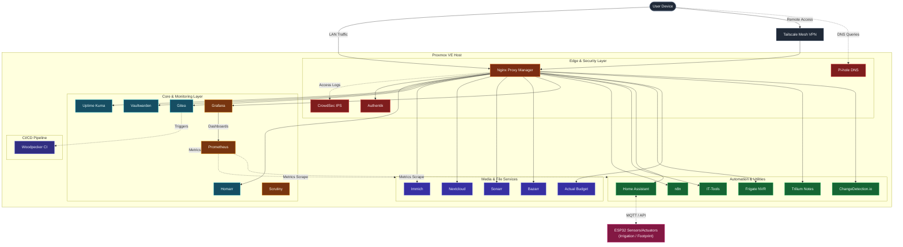

# Homelab

Declarative, Ansible-driven infrastructure for a Proxmox-based homelab — self-hosted media, productivity, security, monitoring, home automation, and CI/CD services running across isolated LXC containers, with a growing ESP32 sensor/automation footprint, multi-hypervisor options, Infrastructure as Code (Terraform) templates, and an early Kubernetes track.


---

## Table of Contents

* [Overview](#overview)
* [Tech Stack](#tech-stack)
* [Architecture](#architecture)
* [Hardware Specifications](#hardware-specifications)
* [Core Services Inventory](#core-services-inventory)
* [Infrastructure as Code & Hypervisors](#infrastructure-as-code--hypervisors)
* [ESP32 / Embedded](#esp32--embedded)
* [Kubernetes Track](#kubernetes-track)
* [Repository Structure](#repository-structure)
* [Getting Started & Automation Scripts](#getting-started--automation-scripts)
* [Configuration & Security Practices](#configuration--security-practices)
* [Secondary Storage (NAS)](#secondary-storage-nas)
* [Roadmap](#roadmap)
* [Contributing](#contributing)
* [License](#license)

---

## Overview

This repository serves as the single source of truth for an advanced self-hosted homelab environment. Proxmox VE acts as the primary hypervisor, while Ansible automates reliable, idempotent deployments of containerized workloads. Infrastructure as Code principles are enforced across both cloud environments and hypervisor layers via modular Terraform configurations.

### Key Functional Domains:
* **`services/`** — Core homelab applications deployed via Docker Compose in isolated LXC containers.
* **`terraform/` & `aws/`** — Enterprise-grade modular Terraform configurations for AWS provisioning and local infrastructure.
* **`hypervisors/`** — IaC definitions and management setups for alternative virtualization platforms (ESXi, Xen, bhyve).
* **`esp32/`** — Embedded C++ firmware and modular YAML configurations dedicated to hardware automation.
* **`kubernetes/`** — Evaluation track exploring container orchestration scalability using K3s.

---

## Tech Stack

| Layer | Technology |
| --- | --- |
| **Cloud Public** | AWS (Terraform modular architecture, VPC, EC2) |
| **Hypervisors** | Proxmox VE 9.2, VMware ESXi, Xen, bhyve |
| **Configuration Management** | Ansible (playbook-driven, idempotent automation) |
| **Infrastructure as Code** | Terraform (v1.5+) |
| **Containerization** | Docker Engine & Docker Compose v2 |
| **Edge & Security** | Nginx Proxy Manager, Authentik, Pi-hole, CrowdSec |
| **Observability** | Prometheus, Grafana, Scrutiny (S.M.A.R.T. monitoring) |
| **Automation & CI/CD** | Woodpecker CI, n8n, GitHub Actions, Makefile workflows |
| **Remote Access** | Tailscale mesh VPN (secure zero-trust access) |

---

## Architecture

Traffic and services are segregated across independent container networks and dedicated static LAN endpoints. The edge is managed securely via Nginx Proxy Manager for TLS termination, Authentik for SSO, Pi-hole for network-wide DNS resolution, and CrowdSec for automated threat mitigation.



---

## Hardware Specifications

| Component | Specification Details |
| --- | --- |
| **Processor** | Intel Core i3-10100F (4 Cores / 8 Threads @ 4.30 GHz) |
| **Graphics** | NVIDIA GeForce GTX 1050 Ti (4 GB VRAM) |
| **Memory** | 8 GB DDR4 RAM |
| **Storage** | 512 GB SATA SSD |
| **Hypervisor OS** | Proxmox VE 9.2.4 (Linux 7.0.14-3-pve) |
| **Virtualization** | LXC containers + QEMU VMs |
| **Embedded Nodes** | ESP32 (Irrigation control; footprint WIP) |
| **Networking** | Tailscale secure mesh VPN overlay |

---

## Core Services Inventory

### Edge & Security

* **Nginx Proxy Manager:** Reverse proxy routing web traffic and automating Let's Encrypt SSL/TLS lifecycle.
* **Authentik:** Identity provider and Single Sign-On (SSO) solution securing internal applications.
* **Pi-hole:** Network-wide DNS sinkhole eliminating ads and malicious trackers at the DNS level.
* **CrowdSec:** Behavioral intrusion prevention system scanning access logs and blocking active threats.

### Core & Monitoring

* **Homarr:** Unified dashboard organizing internal services with resource widgets.
* **Uptime Kuma:** Automated availability monitoring and incident tracking.
* **Vaultwarden:** High-performance, self-hosted password manager.
* **Gitea:** Lightweight private Git source control service.
* **Prometheus & Grafana:** Infrastructure metric harvesting and analytical visualization.
* **Scrutiny:** Hard drive health monitoring through S.M.A.R.T attribute tracking.

### Media, Files & Automation

* **Home Assistant:** Centralized home automation hub.
* **Frigate:** High-performance NVR with real-time AI object detection.
* **Immich:** High-performance photo and video backup solution.
* **Nextcloud:** File sync, share links, and office collaboration.
* **Arr Suite:** Automated media management (Sonarr, Bazarr).
* **Actual Budget:** Privacy-focused personal finance and budgeting system.
* **n8n:** Workflow automation platform (includes custom JS/Python scripts for payload parsing and cryptography).
* **Trilium Notes:** Hierarchical note-taking application supporting deep personal knowledge bases.
* **ChangeDetection.io:** Web page change detection and monitoring notification service.
* **IT-Tools:** Self-hosted collection of everyday developer utilities.

### CI/CD & Networking

* **Woodpecker CI:** Lightweight CI/CD pipeline runner wired to Gitea.
* **OPNsense:** Router/firewall topology with custom backup, HAProxy, and Telegraf configurations.

---

## Infrastructure as Code & Hypervisors

The repository provides clean, production-ready IaC templates:

* **`terraform/`:** Core Terraform manifests (`main.tf`, `providers.tf`).
* **`aws/`:** Structured following enterprise practices, containing separated environments (`dev`, `prod`), robust networking modules (`modules/vpc`), and computing templates (`modules/ec2`).
* **`hypervisors/esxi/`:** Virtual machine provisioning scripts leveraging the community ESXi provider.
* **`hypervisors/xen/`:** Declarative domain configuration files.
* **`hypervisors/bhyve/`:** FreeBSD hypervisor guest deployment patterns.

---

## ESP32 / Embedded

The `esp32/` directory tracks firmware and device configs for home-automation hardware.

* `irrigation/` — ESP32-driven irrigation controller: C++ firmware (`main.cpp`, `valve.cpp`) handling actuation, combined with YAML-based zone and schedule configurations.
* `footprint/` — Planning document for future ESP32 node expansions.

---

## Repository Structure

```text
homelab/
├── .github/                           # Kubernetes track Dependabot & Workflows
├── .gitignore
├── .pre-commit-config.yaml            # Git hooks for linting & formatting
├── CONTRIBUTING.md
├── LICENSE
├── README.md
├── ROADMAP.md
├── SECURITY.md
├── ansible/                           # Core infrastructure playbooks
│   ├── group_vars/
│   ├── main.yml
│   └── playbook.yml
├── aws/                               # Cloud IaC
│   ├── environments/ (dev, prod)
│   └── modules/ (ec2, vpc)
├── esp32/                             # Microcontroller firmware
│   ├── footprint/
│   └── irrigation/ (C++ & YAML configs)
├── hardware/
├── hypervisors/                       # Alt-hypervisor Terraform configs
│   ├── bhyve/
│   ├── esxi/
│   └── xen/
├── inventory/
│   └── hosts.yml
├── kubernetes/                        # K3s Evaluation Track
│   ├── ansible/
│   ├── hardware/
│   ├── services/
│   └── deploy.mk
├── scripts/
│   └── bootstrap.sh
├── services/                          # Dockerized Application Stack
│   ├── actualbudget/
│   ├── arr-suite/
│   ├── authentik/
│   ├── changedetection.io/
│   ├── crowdsec/
│   ├── frigate/
│   ├── gitea/
│   ├── grafana/
│   ├── homarr/
│   ├── homeassistant/
│   ├── immich/
│   ├── it-tools/
│   ├── n8n/ (Includes custom JS/Python parsing scripts)
│   ├── nextcloud/
│   ├── nginx/
│   ├── opnsense/ (Topology, HAProxy templates, Telegraf conf, Python scripts)
│   ├── pi-hole/
│   ├── prometheus/
│   ├── scrutiny/
│   ├── trillium-notes/
│   ├── uptime-kuma/
│   ├── vaultwarden/
│   └── woodpecker-ci/
└── terraform/                         # Core IaC definitions
    ├── main.tf
    └── providers.tf

```

---

## Getting Started & Automation Scripts

### 1. Environment Bootstrap

Initialize local pre-commit hooks and perform baseline validation checks:

```bash
./scripts/bootstrap.sh

```

### 2. Automated Orchestration (Ansible)

Execute deployments against defined targets:

```bash
ansible-playbook -i ansible/group_vars/inventory.ini ansible/group_vars/deploy_services.yml

```

### 3. Manual Service Lifecycle

```bash
cd services/<service-name>
docker compose up -d

```

---

## Configuration & Security Practices

* **Secret Management:** Plaintext credentials are strictly excluded from version control; sensitive elements are managed through ignored `.env` parameters or Ansible Vault.
* **Network Security:** Perimeter protection is reinforced via Tailscale mesh routing, removing the need to expose raw ports externally. Authentik acts as a mandatory SSO gatekeeper for sensitive internal dashboards.
* **Vulnerability Reporting:** See `SECURITY.md` for proper disclosure channels.

---

## Secondary Storage (NAS)

In addition to the main Proxmox node, the infrastructure includes a dedicated server for storage and backup:

* **OS:** OpenMediaVault (OMV)
* **Hardware:** ASUS X451MA Laptop
* **CPU:** Intel Celeron N2830 (2 cores / 2 threads)
* **RAM:** 2 GB DDR3
* **Storage:** 500 GB HDD

---

## Roadmap & Contributing

* Refer to `ROADMAP.md` for planned infrastructure upgrades (such as high-availability clustering and Kubernetes migration).
* Review `CONTRIBUTING.md` prior to submitting adjustments or adding new workloads.

---

## License

Licensed under the terms outlined in `LICENSE`.

```

```
